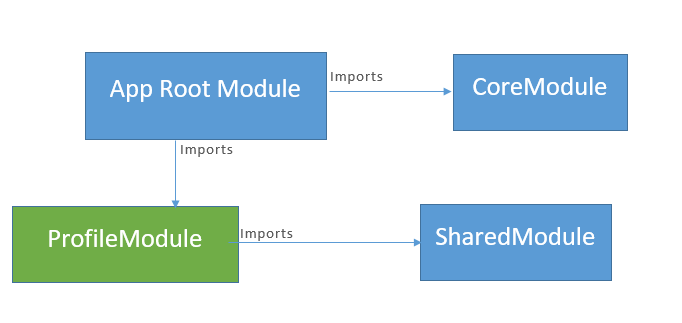

# Angular 2 Boot Camp

## App structure exercise

Based on the concepts seen in the App structure session, refactor the following application so it follows the Folder-by-Feature structure.

## File information:
- [highlight.directive.ts](/src/app/directives/highlight.directive.ts): directive that highlight a text in the application, **can be use by every module**.
- [user.service.ts](/src/app/services/user.service.ts): a service that provides the information of the current user, **can be use by every module but should be the same instance for every module(singleton).** This service depends on UserServiceConfig model.(should be in the same folder)
- [awsome.pipe.ts](/src/app/pipes/awsome.pipe.ts): a pipe that will prepend the word "awsome" to some phrase, **can be use by every module**.
- [title.component](/src/app/components/title): an application component that shows the header of the application, **can be use by every module but should be the same instance for every module(singleton).**
- [profile.component](/src/app/components/profile/): a component that allow us to edit the current user of the application, **this is part of the profile feature**

**Recomendation**: If you put a **service** inside a folder, you must copy with it the "definition" folder that should contain the interface of the service. Also the module that contains the service should have the service in the declaration, for example:

 providers: [
        { provide: 'IUserService', useClass: UserService },
    ],

**HINT**: The solution should have the following structure:

- [Slides](http://slides.com/jdjuan/angular2-day2)
- [Additional resource:](https://angular.io/styleguide#!#04-07)

## Time limit

30 minutes

